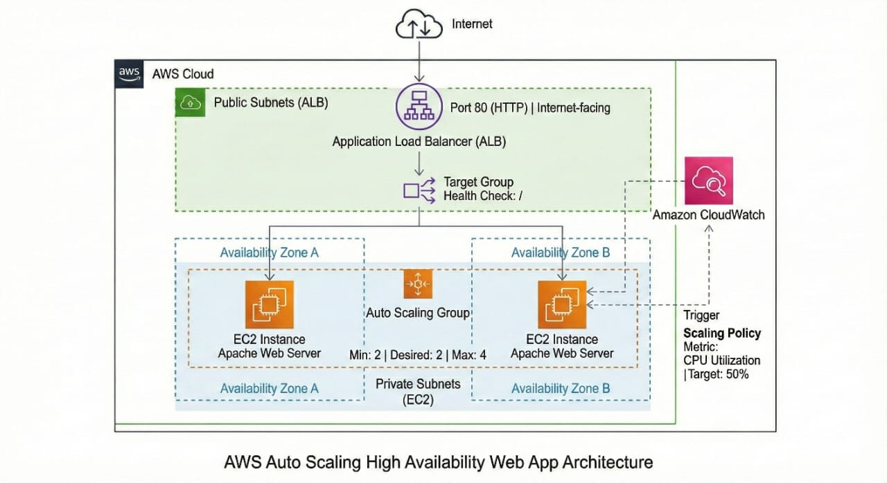
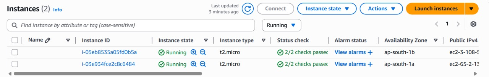
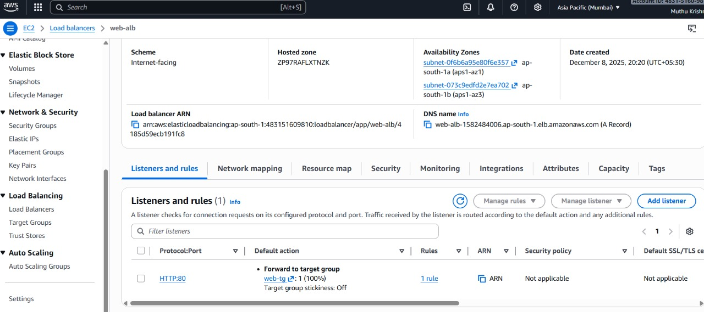
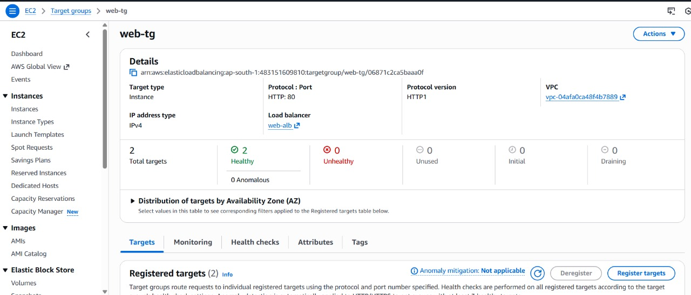

# Auto-Scaling & Highly Available Web Application on AWS

## Project Summary
This project demonstrates how to design and deploy a **highly available and auto-scaling web application** on AWS using core cloud services.

The application distributes incoming traffic across multiple EC2 instances using an **Application Load Balancer** and automatically scales the number of servers based on **CPU utilization**, ensuring reliability, performance, and fault tolerance.

This project was built as a **hands-on learning and portfolio project** to gain practical experience with real-world AWS infrastructure.

---

## Architecture Overview

The application follows a **load-balanced and auto-scaled architecture** designed for high availability.

**Traffic Flow:**

Internet  
→ Application Load Balancer (ALB)  
→ Target Group  
→ Auto Scaling Group (2–4 EC2 instances)

### Key Architecture Concepts
- The **Application Load Balancer** distributes incoming HTTP traffic across multiple EC2 instances.
- The **Auto Scaling Group** ensures a minimum of 2 EC2 instances are always running and can scale up to 4 instances during high load.
- EC2 instances are deployed across **multiple Availability Zones** to provide fault tolerance.
- **Amazon CloudWatch** monitors CPU utilization and triggers scaling actions automatically.

---

## Architecture Diagram



---

## Project Screenshots

### 1️⃣ EC2 Instances (Auto Scaling Group)
Shows multiple EC2 instances launched by the Auto Scaling Group across different Availability Zones.



---

### 2️⃣ Auto Scaling Group Configuration
Shows the desired, minimum, and maximum capacity settings along with the attached launch template.


---

### 3️⃣ Application Load Balancer Listener
Shows the ALB listener configured on HTTP port 80 forwarding traffic to the target group.



---

### 4️⃣ Target Group Health Status
Shows that all EC2 instances are healthy and correctly registered with the target group.



---

### 5️⃣ Website Output via Load Balancer
Shows the website accessed using the ALB DNS name, displaying the EC2 instance hostname to confirm load balancing.


---

## AWS Services Used

- **Amazon EC2** – Hosts the web application
- **Launch Template** – Defines EC2 configuration and startup script
- **Auto Scaling Group (ASG)** – Automatically manages the number of EC2 instances
- **Application Load Balancer (ALB)** – Distributes traffic across EC2 instances
- **Target Group** – Routes traffic to healthy EC2 instances
- **Security Groups** – Controls inbound and outbound traffic
- **Amazon CloudWatch** – Monitors CPU utilization and triggers scaling

---

## Key Features

- Minimum **2 EC2 instances** always running
- Maximum **4 EC2 instances** during high traffic
- CPU-based auto scaling (target utilization: **50%**)
- Health checks to automatically remove unhealthy instances
- Load-balanced traffic distribution across Availability Zones
- Automated web server setup using EC2 user data

---

## EC2 User Data Script

Each EC2 instance installs and starts an Apache web server automatically at launch using the following user data script:

```bash
#!/bin/bash
yum update -y
yum install -y httpd
systemctl start httpd
systemctl enable httpd
echo "<h1>Hello from $(hostname) - Auto Scaling Web Server</h1>" > /var/www/html/index.html
